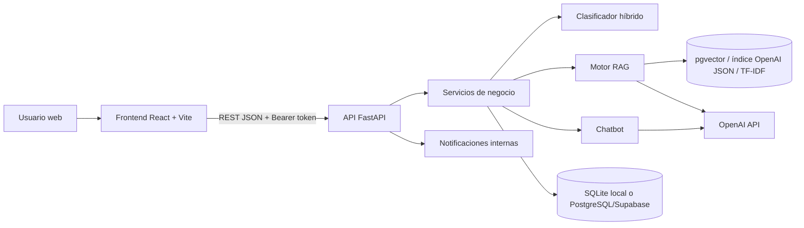
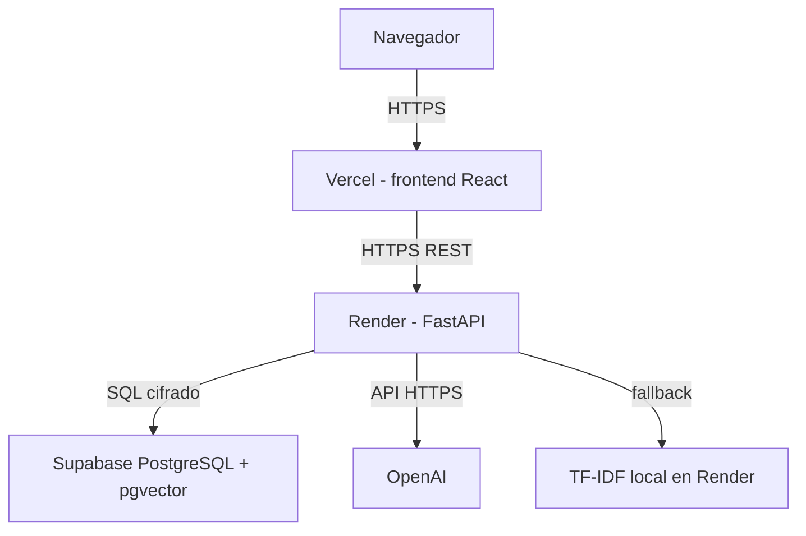
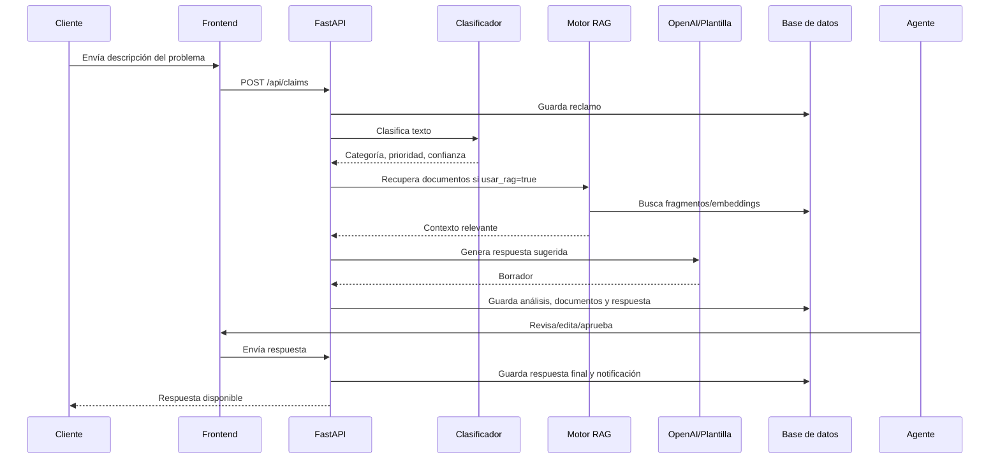
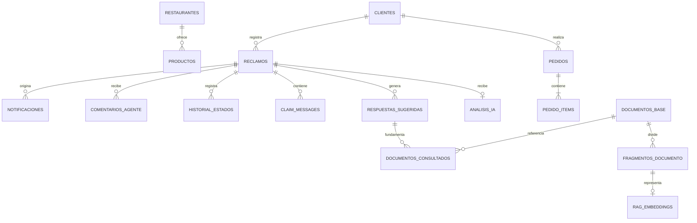

# SmartClaim AI - Documentación técnica y funcional completa

**Proyecto:** SmartClaim AI  
**Tipo:** Plataforma full stack para comercio delivery y gestión inteligente de reclamos  
**Estado documentado:** junio de 2026  
**Repositorio:** `Jhanfranco07/Clasificador-de-Reclamos`

---

## 1. Resumen ejecutivo

SmartClaim AI es una plataforma académica full stack que simula la operación de una empresa digital tipo delivery y centraliza el ciclo completo de atención de reclamos.

El sistema permite que un cliente explore restaurantes, agregue productos al carrito, registre pedidos, reporte problemas y mantenga una conversación con soporte. Cuando se registra un reclamo, el backend puede clasificarlo automáticamente, asignar prioridad, calcular confianza, recuperar documentos internos relevantes y generar una respuesta sugerida. Un agente humano revisa la respuesta antes de enviarla, mientras que un administrador controla la base documental, la configuración de IA y los reportes.

La plataforma utiliza una única experiencia oficial construida con React/Vite y FastAPI, preparada para Vercel, Render y PostgreSQL/Supabase. No es solamente un clasificador: integra catálogo, pedidos, autenticación, reclamos, IA, RAG, revisión humana, mensajería, notificaciones, reportes y administración.

---

## 2. Problema que resuelve

Las empresas digitales reciben reclamos por retrasos, cobros incorrectos, productos faltantes, problemas de seguridad y consultas generales. Si estos casos se procesan manualmente desde el inicio:

- aumenta el tiempo de primera respuesta;
- se asignan categorías y prioridades de forma inconsistente;
- los agentes deben buscar políticas manualmente;
- se redactan respuestas diferentes para casos similares;
- se pierde trazabilidad entre cliente, reclamo y respuesta;
- resulta difícil medir el rendimiento del proceso.

SmartClaim AI reduce ese trabajo mediante clasificación automática, recuperación documental y respuestas sugeridas, sin eliminar la supervisión humana en casos sensibles.

---

## 3. Alcance funcional implementado

### 3.1 Funciones públicas

- Visualización del catálogo de restaurantes y productos.
- Filtrado del catálogo por categorías.
- Acceso al detalle de cada restaurante.
- Creación y edición del carrito antes de iniciar sesión.
- Registro de una cuenta cliente.
- Inicio de sesión.
- Recuperación de contraseña simulada.
- Acceso al chatbot para consultas generales.
- Persistencia local del carrito.
- Redirección al lugar de origen después de iniciar sesión.

### 3.2 Funciones del cliente

- Dashboard personal.
- Catálogo, restaurantes, productos y carrito.
- Confirmación de compra y creación de pedidos.
- Historial de pedidos.
- Detalle de pedido.
- Registro de reclamos asociados a pedidos.
- Historial y detalle de reclamos propios.
- Visualización del estado y línea de tiempo de un reclamo.
- Conversación continua con un agente dentro del reclamo.
- Recepción y lectura de notificaciones.
- Reapertura de reclamos cerrados.
- Centro de ayuda.
- Chatbot con acceso controlado a datos personales reales.
- Edición del nombre y teléfono del perfil.
- Cambio entre tema claro y oscuro.

### 3.3 Funciones del agente

- Dashboard operativo.
- Bandeja de reclamos global.
- Búsqueda, filtros por estado y fechas, y paginación.
- Apertura del detalle técnico de un reclamo.
- Ejecución del análisis IA.
- Visualización de categoría, prioridad, confianza, sentimiento y recomendación.
- Visualización de documentos recuperados mediante RAG.
- Revisión y edición de respuesta sugerida.
- Envío de respuesta al cliente con firma del agente autenticado.
- Conversación continua con el cliente.
- Registro de comentarios internos.
- Escalamiento de casos.
- Cierre de casos.
- Acceso y edición del perfil.

El agente no puede modificar la base documental, la configuración de IA ni los reportes administrativos.

### 3.4 Funciones del administrador

Incluye todas las funciones operativas del agente y además:

- Administración de documentos internos.
- Creación, edición y desactivación de documentos.
- Reindexación de la base documental.
- Consulta del proveedor vectorial activo.
- Configuración del umbral de confianza.
- Activación o desactivación del uso de RAG.
- Configuración de revisión humana obligatoria.
- Configuración de cantidad máxima de documentos recuperados.
- Acceso a reportes globales.
- Filtros avanzados de reportes.
- Exportación de reportes a CSV y PDF.
- Consulta de métricas operativas y de IA.

## 4. Actores y permisos

| Capacidad | Público | Cliente | Agente | Administrador |
|---|---:|---:|---:|---:|
| Ver catálogo | Sí | Sí | No requerido | No requerido |
| Gestionar carrito | Sí | Sí | No | No |
| Crear pedido | No | Sí | No | No |
| Ver pedidos propios | No | Sí | No | No |
| Crear reclamo propio | No | Sí | No | No |
| Ver reclamos propios | No | Sí | No | No |
| Ver todos los reclamos | No | No | Sí | Sí |
| Conversar en reclamo | No | Sí | Sí | Sí |
| Analizar reclamo con IA | No | No | Sí | Sí |
| Editar/enviar respuesta | No | No | Sí | Sí |
| Escalar/cerrar reclamo | No | No | Sí | Sí |
| Comentarios internos | No | No | Sí | Sí |
| Administrar documentos | No | No | No | Sí |
| Reindexar RAG | No | No | No | Sí |
| Configurar IA | No | No | No | Sí |
| Ver reportes globales | No | No | No | Sí |
| Editar perfil propio | No | Sí | Sí | Sí |

---

## 5. Flujo funcional principal

### 5.1 Compra y creación de pedido

1. El visitante explora restaurantes y productos.
2. Agrega productos al carrito.
3. El carrito se conserva localmente en el navegador.
4. Al confirmar la compra, inicia sesión o registra una cuenta.
5. El cliente selecciona dirección y método de pago simulado.
6. El frontend envía el pedido al backend.
7. El backend guarda el pedido y sus productos.
8. El cliente puede consultar el pedido desde su historial.

El proyecto no procesa pagos bancarios reales. El checkout valida y registra una operación simulada.

### 5.2 Registro y tratamiento de un reclamo

1. El cliente abre un pedido afectado o entra a “Mis reclamos”.
2. Describe libremente el problema.
3. El backend registra el reclamo en estado `Nuevo`.
4. Si se solicita análisis, el clasificador procesa el texto.
5. Se asignan categoría, prioridad, confianza, sentimiento y recomendación.
6. El reclamo cambia a `Analizado por IA` o `En revisión`, según el flujo.
7. Si RAG está activo, se recuperan fragmentos documentales relevantes.
8. OpenAI genera una respuesta sugerida cuando existe una clave configurada.
9. Si OpenAI no está disponible, se usa una plantilla local.
10. Un agente revisa, edita y aprueba la respuesta.
11. Al enviarla, el sistema agrega la firma del agente autenticado.
12. El cliente recibe una notificación y puede abrir la conversación.
13. El cliente puede responder para solicitar aclaraciones.
14. El agente puede continuar la conversación, escalar o cerrar el caso.

### 5.3 Estados del reclamo

| Estado | Significado |
|---|---|
| `Nuevo` | Reclamo registrado, aún sin procesamiento completo. |
| `Analizado por IA` | Clasificación y análisis inicial guardados. |
| `En revisión` | Caso pendiente de acción humana o con nueva respuesta del cliente. |
| `Respondido` | Soporte envió una respuesta al cliente. |
| `Escalado` | Caso derivado a un nivel superior o especialista. |
| `Cerrado` | Atención finalizada. Puede reabrirse desde el flujo autorizado. |

### 5.4 Conversación continua

- Cliente y soporte intercambian mensajes dentro de un reclamo.
- Los mensajes internos de agentes no se muestran al cliente.
- Un mensaje del cliente devuelve el caso a revisión.
- Un mensaje del agente marca el caso como respondido.
- Cada respuesta crea una notificación para la parte correspondiente.
- No se permiten nuevos mensajes en un caso cerrado hasta reabrirlo.

### 5.5 Escalamiento

Escalar significa derivar un reclamo a un supervisor, especialista o proceso de mayor autoridad. Se utiliza para fraude, cobros sensibles, seguridad, baja confianza o decisiones que un agente regular no debe confirmar.

El escalamiento:

- cambia el estado del reclamo;
- registra la acción en el historial;
- conserva comentarios y trazabilidad;
- no equivale a cerrar ni responder definitivamente el caso.

---

## 6. Arquitectura general

### 6.1 Vista de alto nivel



### 6.2 Arquitectura por capas

| Capa | Responsabilidad | Tecnologías principales |
|---|---|---|
| Presentación principal | Experiencia pública, cliente, agente y administrador | React, TypeScript, Vite, Tailwind, Radix UI, Lucide |
| API | Validación HTTP, autorización y exposición de casos de uso | FastAPI, Pydantic |
| Aplicación/negocio | Reclamos, pedidos, respuestas, mensajes, reportes | Python |
| IA/NLP | Clasificación, prioridad, sentimiento y generación | scikit-learn, reglas, OpenAI |
| Recuperación documental | Fragmentación, embeddings, similitud y contexto | pgvector, OpenAI embeddings, TF-IDF |
| Persistencia | Datos operativos, trazabilidad y configuración | SQLite / PostgreSQL |
| Despliegue | Frontend y backend administrados | Vercel, Render, Supabase |

### 6.3 Arquitectura de despliegue



### 6.4 Secuencia de análisis IA + RAG



---

## 7. Tecnologías utilizadas

### 7.1 Backend y datos

- Python 3.11 en despliegue.
- FastAPI.
- Uvicorn.
- Pydantic.
- SQLite para desarrollo local.
- PostgreSQL/Supabase para producción.
- `psycopg` para PostgreSQL.
- pgvector para vectores persistentes.
- Pandas.
- scikit-learn.
- SciPy.
- Joblib.
- OpenAI SDK.
- pytest.

### 7.2 Frontend

- React 18.
- TypeScript.
- Vite.
- React Router.
- Tailwind CSS.
- Radix UI y componentes estilo shadcn.
- Lucide React.
- Recharts.
- `next-themes`.
- Sonner para notificaciones visuales.
- jsPDF y jsPDF AutoTable.
- Playwright.

### 7.3 Infraestructura

- Vercel para el frontend.
- Render para el backend.
- Supabase para PostgreSQL y pgvector.
- GitHub para control de versiones y despliegue continuo.

---

## 8. Estructura del proyecto

```text
smartclaim_ai/
|-- backend/
|   |-- __init__.py
|   `-- main.py                    # API FastAPI, DTO, permisos y casos de uso HTTP
|-- frontend/
|   |-- src/app/
|   |   |-- components/            # Layouts, conversación, chatbot, tema y UI
|   |   |-- contexts/              # Estado global de autenticación
|   |   |-- data/                  # Datos/fallback del catálogo
|   |   |-- pages/                 # Pantallas públicas, cliente, agente y admin
|   |   |-- services/              # Cliente REST y acceso a la API
|   |   |-- styles/                # Tokens, tema y estilos globales
|   |   `-- types/                 # Tipos TypeScript
|   |-- e2e/                       # Pruebas Playwright por rol
|   |-- package.json
|   `-- vercel.json                # Build Vite y rewrite SPA
|-- data/
|   |-- reclamos_entrenamiento.csv # Dataset académico de clasificación
|   `-- smartclaim.db              # Base SQLite local
|-- database/
|   |-- db_connection.py           # Abstracción SQLite/PostgreSQL
|   |-- repositories.py            # Operaciones de persistencia
|   |-- schema.sql                 # Esquema SQLite
|   |-- seed_data.sql              # Datos base SQLite
|   |-- postgres_schema.sql        # Esquema PostgreSQL + pgvector
|   `-- postgres_seed_data.sql     # Datos base PostgreSQL
|-- models/
|   |-- claim_classifier.joblib    # Clasificador entrenado
|   `-- training_report.txt        # Métricas del entrenamiento
|-- modules/
|   |-- classifier.py              # Clasificador híbrido ML + reglas
|   |-- rag_engine.py              # Fragmentación, recuperación y respuesta
|   |-- openai_embeddings.py       # Índice y búsqueda con embeddings OpenAI
|   |-- chatbot_service.py         # Intenciones, contexto y chatbot
|   |-- config.py                  # Configuración de runtime y CORS
|   |-- metrics.py                 # Métricas operativas
|   |-- security.py                # Hash de contraseñas y tokens
|   `-- text_processing.py         # Normalización, sentimiento y entidades
|-- scripts/                       # Preparación, entrenamiento, índices y migración
|-- tests/                         # Pruebas funcionales y de API
|-- vector_store/                  # Artefactos vectoriales locales
|-- requirements.txt
|-- render.yaml                    # Despliegue de FastAPI en Render
|-- Procfile                       # Comando alternativo de proceso web
|-- runtime.txt                    # Versión Python para despliegue
|-- README.md
|-- AUDITORIA_CALIDAD.md
|-- DICCIONARIO_DATOS.md
`-- DOCUMENTACION_TECNICA_COMPLETA.md
```

---

## 9. Arquitectura del frontend

### 9.1 Rutas públicas

| Ruta | Pantalla | Propósito |
|---|---|---|
| `/` | Landing/catálogo | Entrada pública y exploración comercial |
| `/login` | Inicio de sesión | Autenticación |
| `/register` | Registro | Creación de cuenta cliente |

### 9.2 Rutas del cliente

| Ruta | Propósito |
|---|---|
| `/dashboard` | Resumen personal |
| `/restaurants` | Catálogo autenticado |
| `/restaurants/:id` | Detalle del restaurante |
| `/products` | Vista de productos |
| `/cart` | Gestión del carrito |
| `/checkout` | Confirmación del pedido |
| `/orders` | Historial de pedidos |
| `/orders/:id` | Detalle del pedido |
| `/claims` | Historial de reclamos propios |
| `/claims/new` | Registro de reclamo |
| `/claims/:id` | Detalle, historial y conversación |
| `/help` | Centro de ayuda |
| `/profile` | Perfil editable |

### 9.3 Rutas de agente y administrador

| Ruta | Agente | Admin | Propósito |
|---|---:|---:|---|
| `/admin` | Sí | Sí | Dashboard operativo |
| `/admin/claims` | Sí | Sí | Bandeja de reclamos |
| `/admin/claims/:id` | Sí | Sí | Revisión y atención |
| `/admin/profile` | Sí | Sí | Perfil |
| `/admin/knowledge` | No | Sí | Base documental |
| `/admin/ai-config` | No | Sí | Configuración IA |
| `/admin/reports` | No | Sí | Reportes |

### 9.4 Estado y experiencia de usuario

- `AuthContext` conserva la sesión y expone el usuario autenticado.
- Las rutas protegidas validan autenticación y rol.
- El inicio de sesión conserva la ruta desde la que llegó el usuario.
- El carrito se conserva en almacenamiento local.
- `next-themes` conserva el tema claro/oscuro.
- Sonner muestra confirmaciones y errores no intrusivos.
- El frontend consume la API mediante un cliente centralizado.
- Las páginas usan carga diferida para reducir el paquete inicial.
- El chatbot flotante está disponible como ayuda transversal.

---

## 10. Arquitectura del backend y API

La API central está definida en `backend/main.py`. FastAPI valida los cuerpos de solicitud, aplica dependencias de autenticación y delega la persistencia a `database/repositories.py`.

### 10.1 Convenciones

- Formato de intercambio: JSON.
- Autenticación: `Authorization: Bearer <token>`.
- Errores HTTP:
  - `400`: solicitud inválida;
  - `401`: sesión inválida;
  - `403`: permiso insuficiente;
  - `404`: recurso inexistente;
  - `409`: conflicto de estado;
  - `500`: error interno controlado.

### 10.2 Catálogo completo de endpoints

| Método | Endpoint | Acceso | Función |
|---|---|---|---|
| GET | `/health` | Público | Salud de API, base y RAG |
| POST | `/api/chat` | Público/opcional auth | Chatbot general o personalizado |
| POST | `/api/auth/login` | Público | Iniciar sesión |
| POST | `/api/auth/register` | Público | Registrar cliente |
| POST | `/api/auth/password-reset/request` | Público | Solicitud simulada de recuperación |
| GET | `/api/auth/me` | Autenticado | Consultar perfil |
| PATCH | `/api/auth/me` | Autenticado | Editar perfil |
| GET | `/api/catalog` | Público | Listar restaurantes y productos |
| GET | `/api/notifications` | Autenticado | Listar notificaciones |
| PATCH | `/api/notifications/read` | Autenticado | Marcar notificaciones como leídas |
| GET | `/api/orders` | Cliente | Listar pedidos propios |
| POST | `/api/orders` | Cliente | Crear pedido |
| GET | `/api/orders/{id}` | Autenticado autorizado | Ver pedido |
| GET | `/api/dashboard` | Agente/Admin | Métricas operativas |
| GET | `/api/claims` | Autenticado | Listar reclamos permitidos con filtros |
| POST | `/api/claims` | Autenticado | Crear reclamo |
| GET | `/api/claims/{id}` | Autenticado autorizado | Ver reclamo |
| GET | `/api/claims/{id}/messages` | Autenticado autorizado | Ver conversación |
| POST | `/api/claims/{id}/messages` | Autenticado autorizado | Agregar mensaje |
| POST | `/api/claims/{id}/close` | Agente/Admin | Cerrar reclamo |
| POST | `/api/claims/{id}/reopen` | Autenticado autorizado | Reabrir reclamo |
| GET | `/api/claims/{id}/comments` | Agente/Admin | Ver comentarios internos |
| POST | `/api/claims/{id}/comments` | Agente/Admin | Crear comentario interno |
| POST | `/api/claims/{id}/analyze` | Agente/Admin | Ejecutar IA y respuesta sugerida |
| PATCH | `/api/claims/{id}/state` | Agente/Admin | Cambiar estado |
| PATCH | `/api/responses/{id}` | Agente/Admin | Editar respuesta sugerida |
| POST | `/api/responses/{id}/approve` | Agente/Admin | Aprobar, firmar y enviar respuesta |
| GET | `/api/documents` | Admin | Listar documentos e índice |
| POST | `/api/documents` | Admin | Crear documento y reindexar |
| PUT | `/api/documents/{id}` | Admin | Editar documento y reindexar |
| DELETE | `/api/documents/{id}` | Admin | Desactivar documento y reindexar |
| POST | `/api/documents/reindex` | Admin | Reconstruir índice RAG |
| GET | `/api/config` | Admin | Consultar configuración IA |
| PUT | `/api/config` | Admin | Modificar configuración IA |
| GET | `/api/reports` | Admin | Reportes filtrables |

---

## 11. Persistencia y modelo de datos

### 11.1 Proveedores

- **SQLite:** desarrollo local y pruebas.
- **PostgreSQL/Supabase:** producción y persistencia centralizada.
- La selección se realiza mediante `DB_PROVIDER`, `APP_ENV` y `DATABASE_URL`.
- `database/db_connection.py` adapta consultas parametrizadas para ambos motores.

### 11.2 Entidades principales

| Tabla | Propósito |
|---|---|
| `auth_users` | Cuentas autenticables y roles |
| `clientes` | Datos comerciales de clientes |
| `usuarios` | Usuarios operativos heredados del modelo académico |
| `restaurantes` | Catálogo de comercios |
| `productos` | Productos por restaurante |
| `pedidos` | Cabecera de pedidos |
| `pedido_items` | Productos comprados |
| `reclamos` | Caso central de soporte |
| `categorias_reclamo` | Catálogo de categorías |
| `prioridades` | Catálogo de prioridades |
| `estados_reclamo` | Estados permitidos |
| `analisis_ia` | Resultado del clasificador |
| `respuestas_sugeridas` | Borrador, edición y respuesta final |
| `documentos_base` | Políticas, FAQ, procedimientos y manuales |
| `fragmentos_documento` | Partes recuperables de documentos |
| `rag_embeddings` | Vectores pgvector en PostgreSQL |
| `documentos_consultados` | Evidencia documental usada por respuesta |
| `claim_messages` | Conversación cliente-soporte |
| `notificaciones` | Avisos para usuarios |
| `historial_estados` | Trazabilidad de cambios |
| `comentarios_agente` | Notas internas |
| `configuracion_modelo_ia` | Parámetros funcionales de IA |
| `evaluacion_respuesta` | Evaluación académica de respuestas |
| `dataset_entrenamiento` | Copia del dataset usado |
| `logs_sistema` | Eventos técnicos y de negocio |

### 11.3 Relaciones principales



### 11.4 Inicialización y migración

- `database/schema.sql`: crea el esquema SQLite.
- `database/seed_data.sql`: inserta catálogos, documentos y datos de demostración.
- `database/postgres_schema.sql`: crea el esquema PostgreSQL y extensión `vector`.
- `database/postgres_seed_data.sql`: inserta datos base de producción/demo.
- `scripts/prepare_database.py`: inicializa la base activa.
- `scripts/migrate_sqlite_to_postgres.py`: migra datos seleccionados de SQLite a PostgreSQL.

---

## 12. Inteligencia artificial y NLP

### 12.1 Clasificador híbrido

El clasificador de `modules/classifier.py` combina:

1. **Modelo supervisado local**
   - Vectorización TF-IDF.
   - Regresión logística.
   - Dataset `data/reclamos_entrenamiento.csv`.
   - Modelo serializado en `models/claim_classifier.joblib`.

2. **Reglas de negocio**
   - Palabras y expresiones asociadas a cada categoría.
   - Reglas especiales para fraude, cobros, tarjeta y retrasos.
   - Respaldo cuando el modelo no está disponible o tiene baja confianza.

3. **Fusión**
   - Si modelo y reglas coinciden, aumenta la confianza.
   - Si el modelo tiene confianza suficiente, se prioriza su resultado.
   - Si el modelo duda, se usa la predicción por reglas.

### 12.2 Categorías

- Fraude o seguridad.
- Cobro indebido.
- Retraso de pedido.
- Producto incompleto.
- Producto incorrecto.
- Problema con tarjeta.
- Soporte general.

### 12.3 Resultado del análisis

- Categoría detectada.
- Prioridad.
- Confianza entre `0` y `1`.
- Sentimiento.
- Palabras clave.
- Entidades detectadas.
- Recomendación operativa.
- Nombre del mecanismo utilizado.

### 12.4 Asignación de prioridad

- Fraude y seguridad: crítica.
- Cobros sensibles y términos críticos: crítica o alta.
- Tarjetas y cobros: alta.
- Retrasos con lenguaje urgente o negativo: alta.
- Producto incorrecto/incompleto: normalmente media.
- Casos generales con buena confianza: baja.

### 12.5 Generación de respuesta

- Con `OPENAI_API_KEY`, se usa un modelo de chat de OpenAI.
- El prompt limita promesas, solicitudes de datos sensibles y decisiones definitivas.
- El contexto incluye reclamo, análisis, conversación y documentos recuperados.
- La respuesta no debe incluir nombres inventados ni marcadores.
- Al aprobar, el backend agrega la firma del agente autenticado.
- Sin OpenAI, se genera una plantilla local coherente.
- La respuesta siempre queda disponible para revisión humana antes del envío.

---

## 13. RAG, embeddings y base documental

### 13.1 Objetivo

El motor RAG busca políticas, procedimientos, manuales y preguntas frecuentes relacionadas con el reclamo. Esos documentos fundamentan la respuesta sugerida y permiten mostrar al agente qué información se consultó.

### 13.2 Proceso documental

1. El administrador crea o modifica un documento.
2. El texto se divide en fragmentos de hasta aproximadamente 70 palabras con solapamiento.
3. Los fragmentos se guardan en `fragmentos_documento`.
4. Se construye o actualiza el índice.
5. Al analizar un reclamo, se vectoriza la consulta.
6. Se recuperan los fragmentos más similares.
7. Los resultados se entregan al generador de respuesta.
8. Los documentos usados se registran en `documentos_consultados`.

### 13.3 Estrategias disponibles

El sistema soporta tres mecanismos:

| Estrategia | Almacenamiento | Uso |
|---|---|---|
| Supabase pgvector | Tabla `rag_embeddings` | Opción recomendada en producción |
| Embeddings OpenAI locales | `vector_store/openai_embeddings.json` | Índice semántico local persistido como JSON |
| TF-IDF | Archivos Joblib en `vector_store/` | Respaldo local y modo académico sin costo externo |

### 13.4 Orden real de recuperación

1. Se intenta buscar en el índice JSON de embeddings OpenAI cuando está habilitado y existe.
2. Si no devuelve resultados y PostgreSQL + pgvector están habilitados, se consulta `rag_embeddings`.
3. Si falla o no hay embeddings persistidos, se usa TF-IDF.

### 13.5 Uso de `usar_rag`

- Si `usar_rag = true`, se recuperan documentos y se genera una respuesta contextualizada.
- Si `usar_rag = false`, no se consultan documentos ni se registran documentos usados.
- Sin RAG, el sistema genera una respuesta básica por plantilla.

### 13.6 Costos de OpenAI

La API puede consumirse en:

- reindexación con embeddings;
- vectorización de consultas para búsqueda semántica;
- generación de respuestas sugeridas;
- respuestas del chatbot que requieren OpenAI.

TF-IDF y reglas locales no consumen la API de OpenAI.

---

## 14. Chatbot

El chatbot es un módulo auxiliar y no sustituye el flujo formal de reclamos.

### 14.1 Consultas públicas

- Cómo realizar un pedido.
- Cómo crear un reclamo.
- Cómo contactar soporte.
- Orientación ante problemas sensibles.

### 14.2 Consultas autenticadas

- Cantidad de pedidos.
- Pedidos recientes.
- Pedidos en camino.
- Estado de un pedido.
- Cantidad y estado de reclamos.
- Reclamos abiertos.
- Notificaciones no leídas.
- Resumen del carrito.

### 14.3 Funcionamiento

- Detecta intenciones mediante reglas.
- Para datos personales consulta información real del usuario autenticado.
- No expone datos personales sin sesión.
- Puede usar RAG y OpenAI para consultas generales no cubiertas.
- Si OpenAI falla, devuelve una respuesta local controlada.

---

## 15. Reportes y métricas

### 15.1 Indicadores principales

- Total de reclamos registrados.
- Reclamos abiertos.
- Reclamos cerrados.
- Tiempo promedio de resolución.
- Tiempo promedio de primera respuesta.
- Tasa de aprobación de respuestas.
- Casos escalados.
- Confianza promedio del sistema IA.

### 15.2 Distribuciones y análisis

- Reclamos por categoría.
- Reclamos por prioridad.
- Reclamos por estado.
- Evolución temporal.
- Tiempo de primera respuesta por categoría.
- Métricas de revisión de respuestas.
- Insights automáticos, por ejemplo categoría más frecuente o nivel de aprobación.

### 15.3 Filtros y exportación

- Fecha inicial y final.
- Estado.
- Categoría.
- Prioridad.
- Exportación CSV.
- Exportación PDF.

Los reportes administrativos no son accesibles para agentes ni clientes.

---

## 16. Seguridad

### 16.1 Autenticación

- Contraseñas almacenadas mediante PBKDF2-SHA256 con salt aleatorio.
- Token Bearer firmado con HMAC-SHA256.
- Expiración predeterminada del token: 12 horas.
- Validación de usuario activo.
- Perfil y operaciones asociadas a la identidad autenticada.

### 16.2 Autorización

- Dependencia general para usuario autenticado.
- Dependencia `require_staff` para agente o administrador.
- Dependencia `require_admin` para acciones administrativas.
- Un cliente solo puede registrar y consultar reclamos propios.
- Un cliente solo puede consultar pedidos propios.
- Los comentarios internos no se muestran al cliente.
- Las rutas del frontend también restringen el acceso por rol.

### 16.3 Producción

- `AUTH_SECRET` debe tener al menos 32 caracteres.
- CORS se limita a los orígenes configurados.
- Las previews de Vercel solo se habilitan explícitamente.
- `.env` está ignorado por Git.
- No deben almacenarse claves reales en el repositorio.

### 16.4 Límites de seguridad actuales

- El token es una implementación propia y no un proveedor OAuth/OIDC.
- No existe segundo factor de autenticación.
- La recuperación de contraseña es simulada.
- No hay rate limiting persistente.
- No hay integración real con pasarela de pagos.
- Para producción comercial se recomienda un proveedor de identidad administrado.

---

## 17. Variables de entorno

No se deben publicar valores secretos. Esta tabla documenta solamente los nombres y propósitos.

| Variable | Uso |
|---|---|
| `APP_ENV` | `development` o `production` |
| `AUTH_SECRET` | Firma segura de tokens |
| `DB_PROVIDER` | `sqlite` o `postgres` |
| `DATABASE_URL` | Conexión PostgreSQL/Supabase |
| `DATABASE_PATH` | Ruta SQLite sugerida para configuración local |
| `CORS_ORIGINS` | Orígenes permitidos separados por coma |
| `FRONTEND_URL` | URL principal del frontend |
| `ALLOW_VERCEL_PREVIEWS` | Permite orígenes preview cuando se implementa |
| `USE_RAG` | Bandera general sugerida para RAG |
| `ENABLE_PGVECTOR_RAG` | Activa recuperación con Supabase pgvector |
| `USE_OPENAI_EMBEDDINGS` | Activa embeddings OpenAI |
| `OPENAI_API_KEY` | Clave privada de OpenAI |
| `OPENAI_CHAT_MODEL` | Modelo usado para respuestas/chatbot |
| `OPENAI_EMBEDDING_MODEL` | Modelo de embeddings |
| `RAG_TOP_K` | Cantidad máxima de resultados semánticos |
| `RAG_SIMILARITY_THRESHOLD` | Umbral mínimo de similitud |
| `VITE_API_URL` | URL pública del backend consumida por Vercel |

Valores recomendados para producción con Supabase y OpenAI:

```text
APP_ENV=production
DB_PROVIDER=postgres
ENABLE_PGVECTOR_RAG=true
USE_OPENAI_EMBEDDINGS=true
USE_RAG=true
OPENAI_CHAT_MODEL=gpt-4.1-mini
OPENAI_EMBEDDING_MODEL=text-embedding-3-small
RAG_TOP_K=3
RAG_SIMILARITY_THRESHOLD=0.70
```

---

## 18. Instalación y ejecución local

### 18.1 Backend

```powershell
cd "c:\Users\PC\Documents\2 - PROYECTOS DEV\smartclaim_ai"
python -m venv .venv
.\.venv\Scripts\Activate.ps1
python -m pip install --upgrade pip
pip install -r requirements.txt
python scripts/prepare_database.py
python scripts/train_model.py
python scripts/build_rag_index.py
python -m uvicorn backend.main:app --host 127.0.0.1 --port 8000 --reload
```

API:

```text
http://127.0.0.1:8000
http://127.0.0.1:8000/docs
```

### 18.2 Frontend

```powershell
cd frontend
npm install
$env:VITE_API_URL="http://127.0.0.1:8000"
npm run dev -- --host 127.0.0.1 --port 5173
```

Frontend:

```text
http://127.0.0.1:5173
```

## 19. Scripts operativos

| Script | Función |
|---|---|
| `scripts/prepare_database.py` | Crea esquema, semillas e importa dataset |
| `scripts/train_model.py` | Entrena el clasificador y genera reporte |
| `scripts/build_rag_index.py` | Fragmenta documentos y construye índice activo |
| `scripts/build_openai_embeddings_index.py` | Construye índice JSON con embeddings OpenAI |
| `scripts/migrate_sqlite_to_postgres.py` | Migra datos locales a PostgreSQL |
| `scripts/generate_sample_data.py` | Genera datos académicos de demostración |
| `scripts/run_backend.ps1` | Facilita el arranque local del backend |

---

## 20. Despliegue

### 20.1 Frontend en Vercel

- Directorio raíz recomendado: `frontend`.
- Framework: Vite.
- Build: `npm run build`.
- Salida: `dist`.
- Variable requerida: `VITE_API_URL`.
- `frontend/vercel.json` configura el rewrite para que React Router funcione al recargar rutas.

### 20.2 Backend en Render

- Servicio web Python.
- Build: `pip install -r requirements.txt`.
- Start:

```text
python -m uvicorn backend.main:app --host 0.0.0.0 --port $PORT
```

- Health check: `/health`.
- Las instancias gratuitas pueden suspenderse por inactividad y tardar en responder al primer acceso.

### 20.3 Base en Supabase

- Ejecutar `database/postgres_schema.sql`.
- Ejecutar `database/postgres_seed_data.sql` o el script de migración.
- Verificar extensión `vector`.
- Verificar que `rag_embeddings` use la dimensión esperada por el modelo.
- Reindexar documentos después de configurar OpenAI y pgvector.

### 20.4 Integración continua de despliegue

Al publicar cambios en la rama conectada:

- Vercel reconstruye el frontend.
- Render reconstruye el backend.
- Supabase conserva los datos independientemente del ciclo de despliegue.

---

## 21. Pruebas y calidad

### 21.1 Pruebas Python

```powershell
python -m compileall -q backend database modules scripts tests
pytest
```

Las pruebas validan:

- creación de cliente y reclamo;
- clasificación;
- RAG activo y respuesta contextualizada;
- respuesta sin RAG;
- persistencia de análisis, respuesta, estado e historial;
- autenticación y registro;
- creación y consulta de pedidos;
- permisos por rol;
- conversación continua;
- tolerancia a fallos de notificaciones;
- firma automática del agente;
- chatbot público y autenticado;
- métricas de reportes;
- salud de base de datos;
- perfil editable;
- filtros y paginación.

### 21.2 Pruebas frontend E2E

```powershell
cd frontend
npm install
npx playwright install
npm run test:e2e
```

Playwright valida:

- navegación del cliente;
- retorno a la ruta original después de iniciar sesión;
- persistencia del tema oscuro;
- restricciones del agente;
- acceso administrativo a reportes y base documental.

### 21.3 Build frontend

```powershell
cd frontend
npm run build
```

---

## 22. Datos y cuentas de demostración

Las semillas crean cuentas para pruebas académicas:

| Rol | Correo | Contraseña |
|---|---|---|
| Cliente | `jhan.perez@gmail.com` | `123456` |
| Agente | `gonzalo.caceres@smartclaim.com` | `123456` |
| Administrador | `admin@smartclaim.com` | `123456` |

Estas credenciales no deben usarse en una operación comercial real.

---

## 23. Guion recomendado para demostración

### 23.1 Cliente

1. Entrar al catálogo sin iniciar sesión.
2. Abrir un restaurante y agregar productos.
3. Revisar el carrito.
4. Iniciar sesión como cliente al confirmar la compra.
5. Crear el pedido.
6. Abrir el pedido y reportar:

```text
Mi pedido llegó con mucha demora, la comida estaba fría y faltó una bebida.
Necesito que revisen el caso porque pagué el pedido completo.
```

7. Abrir “Mis reclamos” y mostrar el caso.

### 23.2 Agente

1. Iniciar sesión como agente.
2. Abrir la bandeja de reclamos.
3. Filtrar o buscar el nuevo caso.
4. Abrir el detalle.
5. Mostrar categoría, prioridad, confianza y documentos.
6. Editar la respuesta sugerida.
7. Enviar la respuesta al cliente.
8. Agregar un comentario interno.

### 23.3 Cliente nuevamente

1. Abrir notificaciones.
2. Entrar al reclamo.
3. Ver la respuesta firmada.
4. Enviar una pregunta adicional.

### 23.4 Administrador

1. Abrir base documental.
2. Crear o modificar una política.
3. Reindexar.
4. Abrir configuración IA.
5. Mostrar el control de RAG y revisión humana.
6. Abrir reportes, aplicar filtros y exportar PDF.

---

## 24. Limitaciones actuales

- La recuperación de contraseña no envía correo real.
- El checkout y el pago son simulados.
- No existe integración con correo, WhatsApp, SMS o push externo.
- La asignación de agentes no implementa balanceo automático de carga.
- El modelo de clasificación usa un dataset académico reducido.
- La evaluación de calidad del LLM no es automática ni exhaustiva.
- El índice JSON de OpenAI no es ideal para múltiples instancias concurrentes.
- TF-IDF es un fallback académico, no una base vectorial neuronal.
- La autenticación propia es adecuada para prototipo, no reemplaza un proveedor de identidad empresarial.
- Los archivos locales de Render pueden perderse entre despliegues; pgvector/Supabase es la opción persistente.
- No existe Dockerización activa en el alcance actual.
- No se procesan pagos ni reembolsos reales.

---

## 25. Mejoras futuras recomendadas

### Prioridad alta

- Integrar recuperación real de contraseña por correo.
- Añadir rate limiting y protección contra abuso.
- Incorporar observabilidad centralizada y alertas.
- Ampliar y versionar el dataset de clasificación.
- Evaluar precisión, recall y F1 por categoría con datos representativos.
- Implementar asignación automática de agentes.
- Añadir SLA y alertas por vencimiento.

### Prioridad media

- Integrar correo, WhatsApp o sistema de tickets externo.
- Incorporar evaluación y feedback de respuestas.
- Añadir panel de supervisión de agentes.
- Versionar documentos y conservar historial de políticas.
- Añadir citas documentales visibles y verificables en respuestas.
- Implementar búsqueda híbrida que combine pgvector y términos.
- Añadir auditoría de accesos y acciones sensibles.

### Evolución de producto

- Integrar pagos reales.
- Conectar estados de delivery en tiempo real.
- Recomendar compensaciones según políticas autorizadas.
- Clasificar automáticamente nuevos mensajes de una conversación.
- Detectar fraude con señales adicionales al texto.
- Incorporar colas de trabajo para análisis y reindexación asíncrona.

---

## 26. Criterios de aceptación académica

El sistema demuestra satisfactoriamente:

- registro y persistencia de reclamos;
- clasificación automática mediante ML y reglas;
- cálculo de confianza y prioridad;
- recuperación documental con alternativas semánticas y TF-IDF;
- generación de respuesta con OpenAI o fallback local;
- revisión humana antes del envío;
- trazabilidad y estados;
- separación de funciones por rol;
- reportes operativos;
- persistencia local y productiva;
- API documentada;
- despliegue frontend/backend;
- pruebas automatizadas.

Para una versión empresarial, deben resolverse las limitaciones de seguridad, identidad, canales externos, pagos, escalabilidad y gobierno del modelo descritas anteriormente.

---

## 27. Glosario

| Término | Definición |
|---|---|
| IA | Inteligencia artificial |
| NLP | Procesamiento de lenguaje natural |
| RAG | Generación aumentada por recuperación |
| Embedding | Representación numérica semántica de un texto |
| pgvector | Extensión PostgreSQL para almacenar y buscar vectores |
| TF-IDF | Representación estadística basada en importancia de términos |
| LLM | Modelo de lenguaje de gran escala |
| Confianza | Seguridad estimada de la clasificación |
| Escalamiento | Derivación de un caso a mayor autoridad o especialidad |
| Revisión humana | Validación del agente antes de una decisión o respuesta final |
| SLA | Tiempo objetivo comprometido para atender un caso |

---

## 28. Documentos relacionados

- `README.md`: instalación rápida y comandos de ejecución.
- `AUDITORIA_CALIDAD.md`: revisión de calidad y pendientes.
- `DICCIONARIO_DATOS.md`: detalle de campos y entidades.
- `frontend/ENTREGA.md`: notas específicas del frontend.
- `/docs` del backend en ejecución: documentación interactiva OpenAPI.

Este documento es la referencia integral del alcance funcional y técnico actualmente implementado en SmartClaim AI.
